<p align="left">
  
</p>


```console
> Automation & Manual QA Engineer
> Application Support
> Playwright Automation
> AWS Infrastructure
> OTT & Broadcast Technology
> API Troubleshooting
``` 

---
<p align="center">
  
</p>


---

### 🔹 What I Do  
- 🛠️ L2 Technical & SaaS Support Engineer — troubleshooting complex application issues across cloud-based SaaS platforms with a focus on root cause analysis and fast resolution.
- ☁️ AWS & API Troubleshooting — diagnosing infrastructure, authentication, and API-related failures in distributed systems.
- 🧪 QA & Test Automation — supporting release quality through test case design, regression testing, and automation practices using tools like Playwright/BugBug.
- 📺 OTT & Streaming Operations Support — ensuring stability of end-to-end OTT workflows, live channel monitoring, and incident resolution.
- 🤝 Cross-functional Engineering Collaboration — working closely with DevOps, backend engineers, and architects to resolve production issues and improve system reliability.  

---

### 🔹 What Drives Me  
- ⚡ Solving complex technical problems and improving the reliability of SaaS and cloud-based systems.
- 🧪 Focused on improving software quality through testing, automation, and continuous improvement practices.
- 🌱 Always learning and exploring DevOps, Cloud, and Automation technologies to expand my technical skill set. 


<p align="center">
  
</p>


### 🔹 Tech Stack & Tools  

- ☁️ **Cloud & Infrastructure (AWS)**  
  
  
  
  
  
  

- 📊 **Monitoring & Observability**  
  

- 🧪 **QA & Test Automation**  
  
  
  
  
  
  

- 🖥️ **System & Scripting**  
  
  

- 🔗 **API & Integration Testing**  
  
  

- 🗂️ **CI/CD & Version Control**  
  
  
  

- 🗄️ **Databases**  
  
  

- 🤝 **Collaboration & Workflow Tools**  
  
  
  

- 💻 **Programming (Basic Proficiency)**  
  
  

- ⚙️ **Configuration & Automation**  
  

- 🛠️ **Development Tools**  
  
  


---

---

### 📈 Contribution Activity

<p align="center">
  
</p>


---

### 🤝 Let’s Connect

<p align="center">
  <a href="https://www.linkedin.com/in/jhrahman/" target="_blank">
    
  </a>
  <a href="mailto:jahidur011@gmail.com">
    
  </a>
</p>


